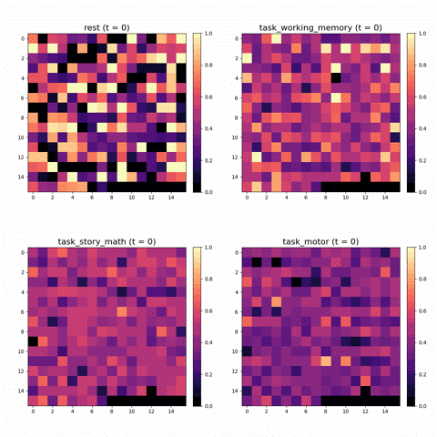
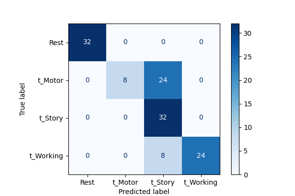
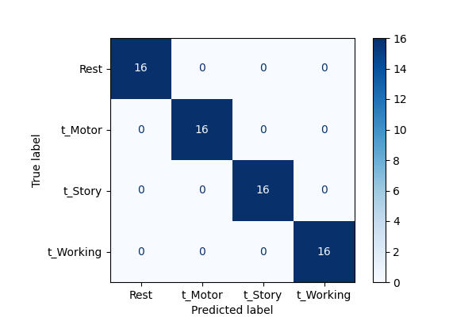

# MEG Scan Classifier

This script allows to train a Recurrent Neural Network (RNN) on a small collection of MEG scans.

## Data

Magnetoencephalography (MEG) is an imaging technique that measures the magnetic fields produced by electrical activity in the brain. These MEG scans can be used to identify what kind of activity a patient is performing during a scan (e.g., doing math, resting)

### Data descrition

- Scans are represented by a matrix of shape `248 ✕ 35624`, where there are 248 MEG sensors and 35624 timesteps in a recording.
- The duration of each recording is approximately 17 seconds.
- Scans are labeled by the activty performed by the patient's during the recording, as well as a patient identifier
  - Activities include: `rest`, `task_working_memory`, `task_story_math` or `task_motor`

### Datasets

- `Intra`: Consists of 40 recordings from one patient (32 training, 8 test)
- `Cross`: Consists of 80 recordings from multiple patients (64 training, 16 test). The training data is collected from two different patients, while the test set is retrieved from one separate patient

# Setup

## Dependencies

You can install the required dependencies from `requirements.txt`:

```bash
pip install -r requirements.txt
```

## Preprocessing

First, you can preprocess the scans using `preprocess.py`:

```bash
python preprocess.py --data [dataset]
```

This will generate a train-, validation- and test set from the input files. Preprocessing consists of the following steps:

- **Robust Scaling**: Features are scaled using the Robust Scaling method, removing outliers and scaling the values between 0 and 1. Scaling parameters are retrieved only from the training set, to prevent information leakage to test set.

- **Downsampling and Data augmentation (optional)**: Individual recordings are downsampled by only keeping every Nth timestep. New samples are generated from the removed timesteps. This is useful as MEG scans are of high resolution and not every timestep is needed for accurate classification.

- **Shuffling**

- **Batching (optional)**: Preprocessing can be batched to prevent running out of memory.

The complete dataset is written to `processed.h5`

**Preprocessing arguments:**

| Parameter             | Type | Default value | Description                               |
| --------------------- | ---- | ------------- | ----------------------------------------- |
| `--data`              | str  | Intra         | Dataset directory to preprocess           |
| `--downsample_factor` | int  | 8             | Downsample and data augmentation factor   |
| `--batch_size`        | int  | 8             | Number of files to be processed per batch |

## Visualization

You can visualize the scans using `visualize.py`

```bash
python visualize.py --data [dataset] --label [class_to_visualize]
```

**Examples:**



**Visualization arguments:**

| Parameter | Type | Default value | Description                                       |
| --------- | ---- | ------------- | ------------------------------------------------- |
| `--data`  | str  | Intra         | Dataset to create visualization from              |
| `--label` | str  | rest          | Class to visualize                                |
| `--index` | int  | 0             | Index number in list of observations to visualize |

# Classification

## Train

You can train and evaluate the RNN model with the following command:

```bash
python train.py --data [dataset]
```

**Training arguments:**

| Parameter            | Type | Default value | Description                                   |
| -------------------- | ---- | ------------- | --------------------------------------------- |
| `--data`             | str  | Intra         | Preprocessed dataset to train and evaluate on |
| `--num_train_epochs` | int  | 5             | Number of training epochs                     |

The trained model will be saved to the `/models` directory

## Evaluate

You can evaluate a trained model using `evaluate.py`. This will return the model accuracy, F1 scores and a confusion matrix.

```bash
python evaluate.py --model [model] --data [dataset]
```

The confusion matrix will be saved to the `/results` directory

## Results

Below are the results of two RNNs trained and evaluated on the `Cross` and `Intra` datasets. The configuration of the RNN is defined in `models.py`. Both models were trained for 5 epochs.

| Model      | Accuracy (%) | F1 scores            |
| ---------- | ------------ | -------------------- |
| RNN, Cross | 75.00        | 1.0, 0.4, 0.67, 0.86 |
| RNN, Intra | 100          | 1.0, 1.0, 1.0, 1.0   |

**Confusion matrices:**



